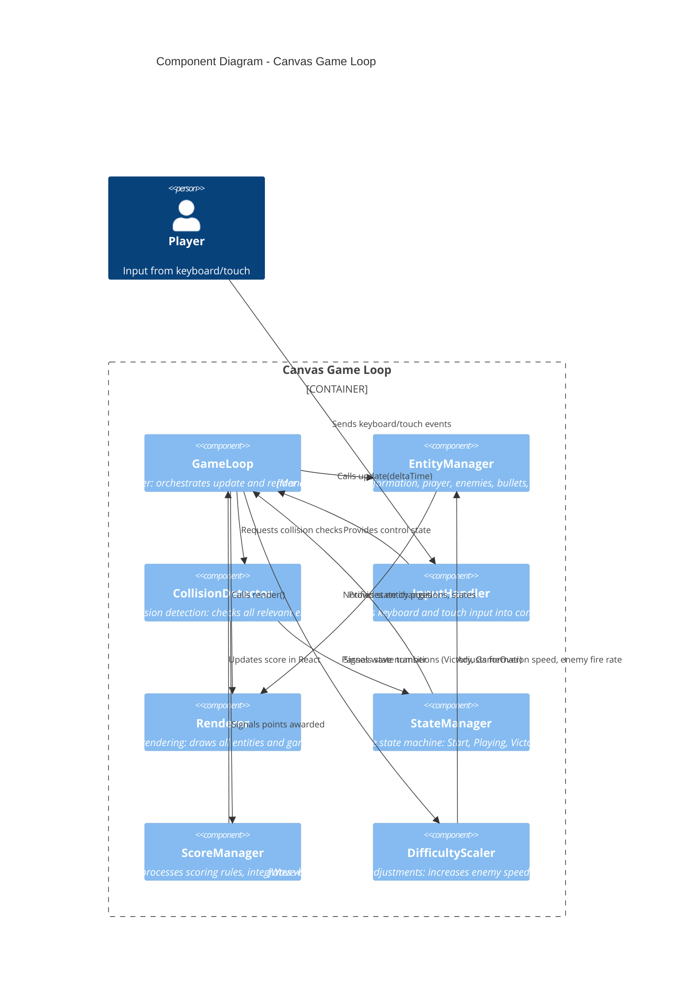

# Space Invaders — Components (C4 Level 3)

The component diagram decomposes the Canvas Game Loop container into its internal components and their interactions.

## Diagram



## Components

### GameLoop
- **Responsibility**: Drive the entire game at 60 FPS, orchestrate the update-collision-render cycle, manage frame timing with delta-time
- **Key Methods**: `start()`, `stop()`, `update(deltaTime)`, `render()`
- **Dependencies**: All other components via orchestration

### EntityManager
- **Responsibility**: Manage lifecycle and state of all game entities (Formation, Player, Enemies, Bullets, Shields, MysteryShip)
- **Key Methods**: `update(deltaTime)`, `reset()`, `getEntity(id)`, `addBullet()`, `removeEnemy()`
- **Uses**: DifficultyScaler

### CollisionDetector
- **Responsibility**: AABB collision detection between all relevant entity pairs (bullets, enemies, player, shields); trigger collision responses
- **Key Methods**: `checkCollisions()`, `checkAABB(a, b)`, `resolveCollision(pair)`
- **Signals**: ScoreManager, StateManager

### InputHandler
- **Responsibility**: Capture and normalize keyboard and touch input, maintain current control state
- **Key Methods**: `onKeyDown()`, `onKeyUp()`, `onTouchStart()`, `onTouchEnd()`, `getInputState()`
- **State**: left, right, fire flags

### Renderer
- **Responsibility**: Draw all entities to the Canvas 2D context: formation, player, bullets, shields, mystery ship, score/lives/wave text
- **Key Methods**: `clear()`, `drawFormation()`, `drawPlayer()`, `drawBullets()`, `drawShields()`, `drawText()`
- **Uses**: Canvas 2D context

### StateManager
- **Responsibility**: Manage game state machine (Start, Playing, Victory, GameOver) and state transitions
- **Key Methods**: `getCurrentState()`, `transitionTo(newState)`, `handleStateExit()`, `handleStateEnter()`
- **States**: Start, Playing, Victory, GameOver

### ScoreManager
- **Responsibility**: Track score, apply scoring rules (enemy point values by row), integrate with React state updates
- **Key Methods**: `addPoints(value)`, `getScore()`, `reset()`, `updateReact()`
- **Signals**: React state updates

### DifficultyScaler
- **Responsibility**: Adjust game difficulty based on wave number: increase formation speed, enemy bullet fire rate, optionally increase enemy count
- **Key Methods**: `scaleByWave(waveNumber)`, `getScaledSpeed()`, `getScaledFireRate()`
- **Uses**: EntityManager

## Component Dependencies

```
GameLoop (orchestrator)
  ├─ EntityManager
  │   └─ DifficultyScaler
  ├─ CollisionDetector
  │   ├─ ScoreManager
  │   └─ StateManager
  ├─ Renderer
  ├─ InputHandler
  └─ StateManager

Data Flow:
InputHandler → GameLoop → EntityManager → Renderer
             → CollisionDetector → ScoreManager/StateManager
             → DifficultyScaler → EntityManager
```

## Related Documentation
- [Architecture](../architecture.md) — System design and principles
- [Containers](containers.md) — Canvas Game Loop within broader system
