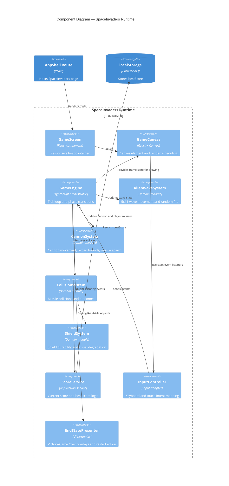

# Component Diagram — SpaceInvaders Runtime

This diagram details internal components of the runtime that implement gameplay behavior.

## C4 Component Diagram

## Component Coverage

- US-001/US-002: `AlienWaveSystem`, `CannonSystem`, `InputController`.
- US-003: `CollisionSystem`, `ShieldSystem`.
- US-004/US-005: `EndStatePresenter`, `ScoreService`.
- US-006: `GameScreen`, `GameCanvas`, `InputController`.
