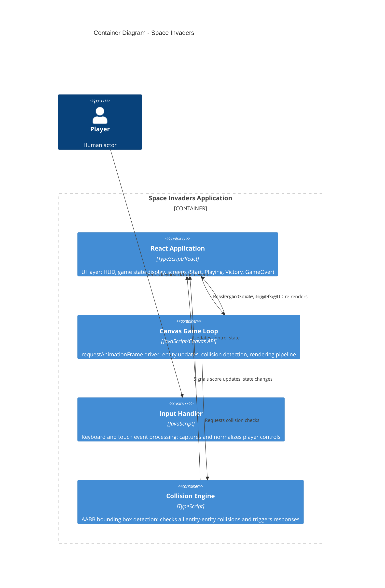

# Space Invaders — Containers (C4 Level 2)

The container diagram decomposes Space Invaders into logical runtime containers: the React application, Canvas game loop, input handling, and collision engine.

## Diagram



## Containers

### React Application
- **Technology**: TypeScript + React
- **Responsibility**: Manages UI state (score, lives, wave number), renders HUD, displays game screens, handles state transitions
- **Key State**: Game state, score, lives, wave number, input flags

### Canvas Game Loop
- **Technology**: JavaScript + Canvas 2D API
- **Responsibility**: Drives the game at 60 FPS using requestAnimationFrame, orchestrates entity updates, manages rendering pipeline
- **Key Operations**: Entity updates (formation, player, bullets, shields), collision requests, Canvas rendering

### Input Handler
- **Technology**: JavaScript event listeners
- **Responsibility**: Captures keyboard (arrow keys, spacebar) and touch events, normalizes input, maintains control state
- **Key Input**: Keyboard events, touch events, mouse events (optional)

### Collision Engine
- **Technology**: TypeScript
- **Responsibility**: AABB bounding box collision detection between bullets, enemies, player, shields; triggers collision responses (scoring, entity removal, state changes)
- **Key Algorithms**: AABB rectangle intersection, collision group filtering

## Data Flow

```
Player Input (keyboard/touch)
  ↓
Input Handler (capture & normalize)
  ↓
React State (control flags)
  ↓
Canvas Game Loop (reads control state)
  ├─ Entity Manager (updates positions)
  ├─ Collision Engine (detects collisions)
  └─ Renderer (draws to Canvas)
  ↓
React State Updates (score, lives, state)
  ↓
HUD Re-renders
```

## Related Documentation
- [Architecture](../architecture.md) — Detailed system design
- [Components](components.md) — Internal structure of Canvas Game Loop
