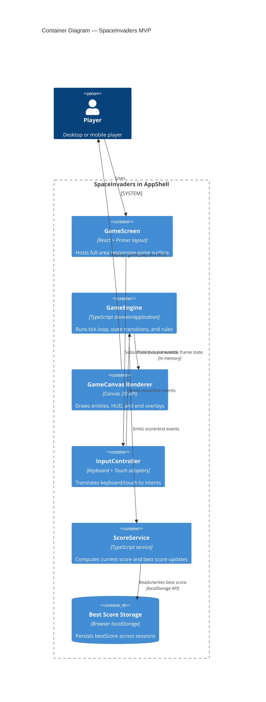

# Container Diagram — SpaceInvaders MVP

This diagram shows the runtime containers and integrations used by the SpaceInvaders MVP.

## C4 Container Diagram

## Mapping to Architecture

- Boundaries and components match [Architecture — SpaceInvaders MVP](../architecture.md).
- Container-level scope is implementation-ready for slices in `../slices/`.
