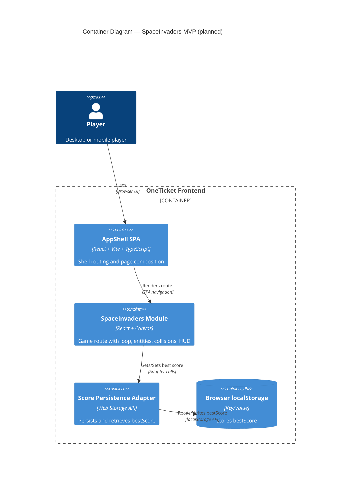

# C4 Containers — SpaceInvaders MVP

## Scope

This view details the deployable/runtime containers used by the MVP in-browser architecture.

## Related Documents

- [Architecture — SpaceInvaders MVP](../architecture.md)
- [C4 Component View](components.md)
