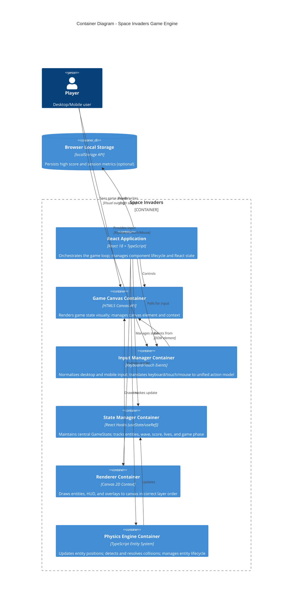

# Space Invaders — C4 Container Diagram

## Overview

This diagram shows the runtime container architecture of Space Invaders. The application is a client-side React application that runs entirely in the browser, with five key containers orchestrating the game loop: the Game Canvas container for rendering, the Input Manager for handling user input, the State Manager for maintaining game state, the Renderer for drawing to canvas, and the Physics Engine for entity updates and collision detection.

## Container Descriptions

### React Application
**Technology:** React 18 + TypeScript  
**Responsibility:** Orchestrates the game loop lifecycle. Acts as the central coordinator that:
- Runs the 60 FPS update loop via `requestAnimationFrame`
- Polls the Input Manager for current input state
- Invokes the Physics Engine to update entity positions and detect collisions
- Maintains the central State Manager
- Instructs the Renderer to draw the current frame
- Handles game phase transitions (title → playing → wave complete → game over)
- Manages React state via hooks

### Game Canvas Container
**Technology:** HTML5 Canvas API  
**Responsibility:** Provides the visual rendering surface for the game. Manages:
- Canvas DOM element creation and sizing
- Responsive scaling to viewport dimensions (aspect ratio 4:3)
- Canvas 2D rendering context
- Pixel-perfect coordinate system (top-left origin)
- Event listener attachment for input (keyboard, touch, mouse)

### Input Manager Container
**Technology:** Keyboard/Touch/Mouse Events  
**Responsibility:** Normalizes user input across platforms. Translates:
- **Desktop:** Left/Right arrow keys → `moveLeft`/`moveRight`; Spacebar → `fire`
- **Mobile:** Left/right swipe → `moveLeft`/`moveRight`; on-screen button tap → `fire`
- Maintains input state across frames (held key = repeated input)
- Exposes simple interface: `getInput()` returns `{ moveLeft, moveRight, fire }`

### State Manager Container
**Technology:** React Hooks (useState/useRef)  
**Responsibility:** Maintains the single source of truth for game state. Tracks:
- **Progression:** Wave number, lives remaining, current score
- **Entities:** Player cannon, enemy formation, projectiles (player and enemy), shields, mystery ship
- **Timers:** Elapsed time, frame count, wave start time
- **Phase:** Current game phase (title, playing, wave complete, game over)
- Enforces immutability; each frame produces a new state object

### Renderer Container
**Technology:** Canvas 2D Context  
**Responsibility:** Draws game state to canvas in correct layer order:
1. Background (black clear)
2. Enemy formation
3. Shields (bunkers)
4. Player cannon
5. Projectiles (player and enemy)
6. Mystery ship (if active)
7. HUD overlay (score, lives, wave)
8. Phase overlays (title screen, game over, wave complete pause)

### Physics Engine Container
**Technology:** TypeScript Entity System  
**Responsibility:** Updates the game simulation. Performs:
- **Position Updates:** Apply velocity to entities; clamp to screen bounds
- **Collision Detection:** AABB broadphase and narrowphase; tests all collision pairs
- **Collision Resolution:** Immediate destruction or state modification
- **Formation Behavior:** Synchronized enemy movement, step-down logic, firing
- **Entity Lifecycle:** Spawn, update, destroy (enemy, projectiles, mystery ship)

## Key Data Flow

1. **Input Phase:** React polls Input Manager → retrieves `{ moveLeft, moveRight, fire }`
2. **Update Phase:** React invokes Physics Engine with current state and delta time → returns updated state
3. **State Phase:** React updates State Manager with new entity positions, collisions resolved
4. **Render Phase:** React invokes Renderer with current state → draws to Game Canvas
5. **Storage Phase:** React optionally writes high score to Local Storage

## Technology Choices

- **React Hooks:** Lightweight state management without Redux; sufficient for single-player game
- **HTML5 Canvas:** Immediate-mode rendering; full control over frame timing and visuals
- **TypeScript:** Type safety for entity system and game state interfaces
- **requestAnimationFrame:** Browser-native frame sync; syncs with display refresh rate (typically 60 FPS)
- **localStorage:** Optional persistence for high score across sessions

## Cross-References

- [Architecture Documentation](../architecture.md) — Full technical decisions and design principles
- [System Context Diagram](./system-context.md) — Showing player interactions and external systems
- [Component Diagram](./components.md) — Detailed breakdown of components within containers
- [Deployment Diagram](./deployment.md) — Runtime infrastructure and hosting
