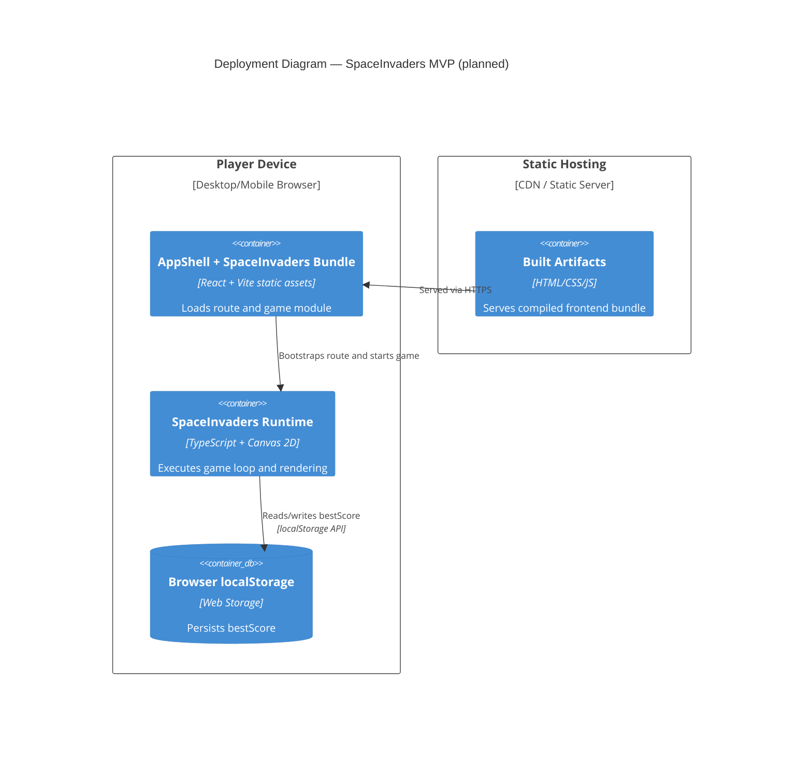

# Deployment Diagram — SpaceInvaders MVP

This diagram represents the target MVP deployment model (`planned`) for the browser-only runtime.

## C4 Deployment Diagram

## Deployment Notes

- No backend container is required for MVP scope.
- Best score persistence remains browser-local only.
- Any future leaderboard would introduce additional containers and trust boundaries.
