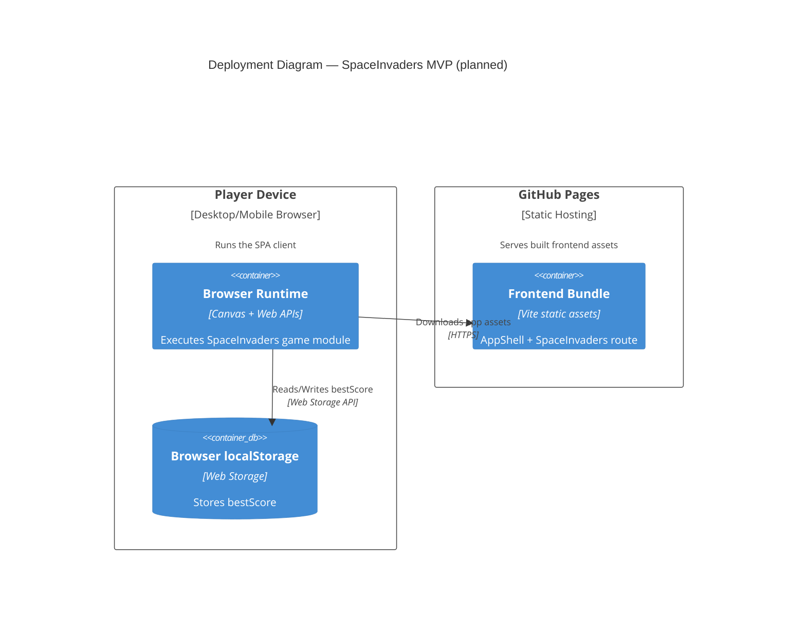

# C4 Deployment — SpaceInvaders MVP

## Scope

This deployment view captures the MVP target runtime: static frontend hosting and browser execution.

## Related Documents

- [Architecture — SpaceInvaders MVP](../architecture.md)
