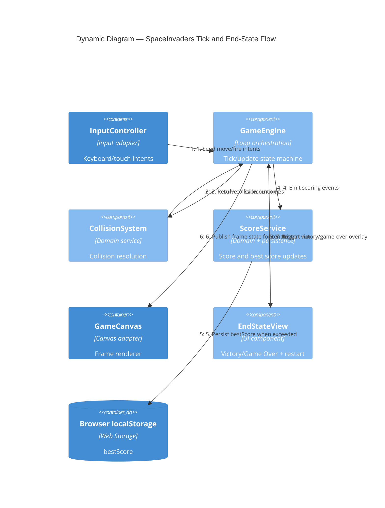

# C4 Dynamic — SpaceInvaders Gameplay Loop

## Scope

This dynamic view shows the runtime flow from player input to frame rendering and score persistence.

## Related Documents

- [Architecture — SpaceInvaders MVP](../architecture.md)
