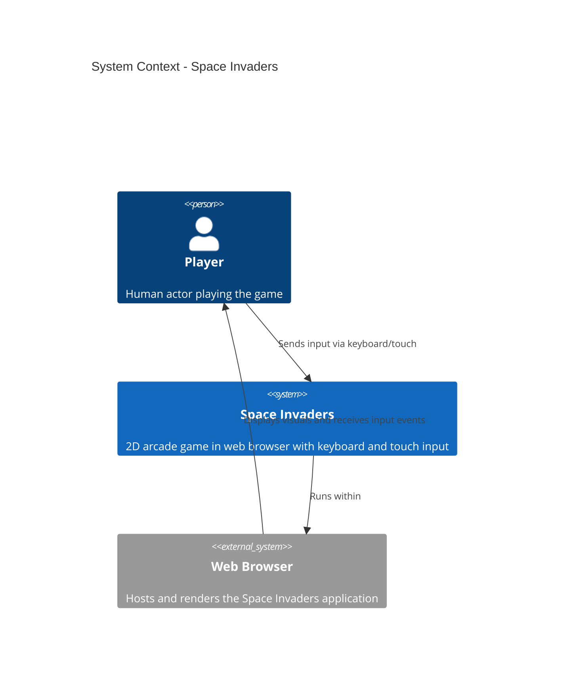

# Space Invaders — System Context (C4 Level 1)

The system context shows how Space Invaders fits into the world of its users and external systems.

## Diagram

## Context

- **Player**: Human user interacting with the game via keyboard (desktop) or touch (mobile)
- **Space Invaders System**: Core game application with UI, game loop, entity management, and collision detection
- **Web Browser**: Runtime environment that hosts the React application, Canvas rendering, and JavaScript execution

## Key Interactions

- Player sends keyboard events (arrow keys, spacebar) or touch events (swipe, tap) to the game
- Browser provides the DOM, Canvas API, and event system for the game to run
- Game renders output to Canvas and updates HUD via React
