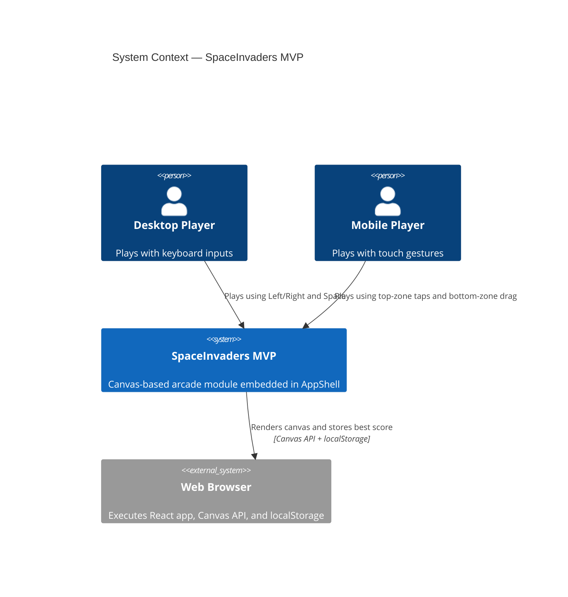

# System Context — SpaceInvaders MVP

This diagram shows the SpaceInvaders MVP in its product context.

## C4 Context Diagram

## Scope Notes

- In scope: gameplay loop, rendering, input handling, scoring, end states.
- Out of scope: backend services, authentication, multiplayer, leaderboard.

See [Architecture — SpaceInvaders MVP](../architecture.md) for decisions and constraints.
