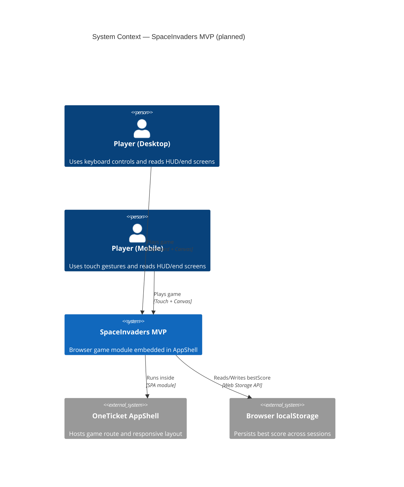

# C4 System Context — SpaceInvaders MVP

## Scope

This diagram shows the SpaceInvaders MVP boundaries in AppShell and the external actors/systems it depends on.

## Related Documents

- [Architecture — SpaceInvaders MVP](../architecture.md)
- [C4 Container View](containers.md)
