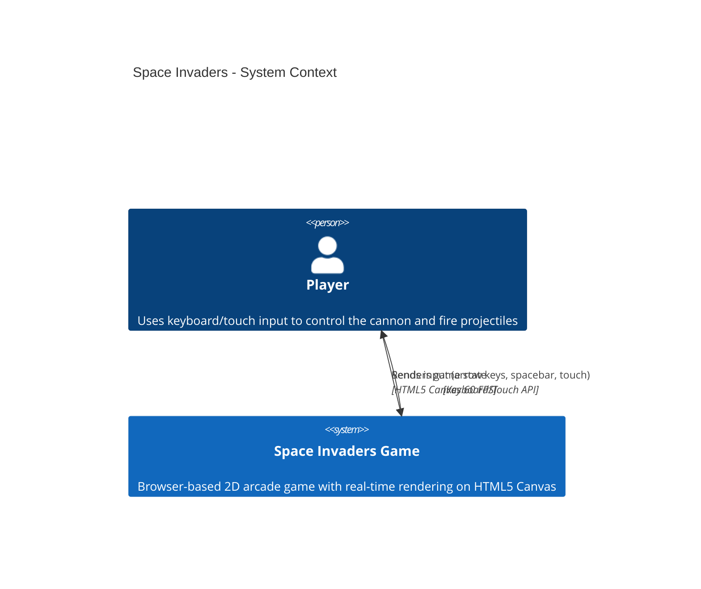

# Space Invaders — System Context

Space Invaders is a browser-based 2D arcade game that players interact with through keyboard/touch input and visual rendering on an HTML5 canvas. The system runs entirely on the client side, requiring no backend services or external APIs.

## System Boundaries

The game forms a single, cohesive system encompassing input handling, game loop orchestration, entity management, collision detection, and canvas rendering. Players interact with the game via keyboard (desktop) or touch (mobile), receiving visual feedback through real-time canvas updates at 60 FPS.

---

## Related Architecture

See [../architecture.md](../architecture.md) for complete technical design, component details, and implementation constraints.
